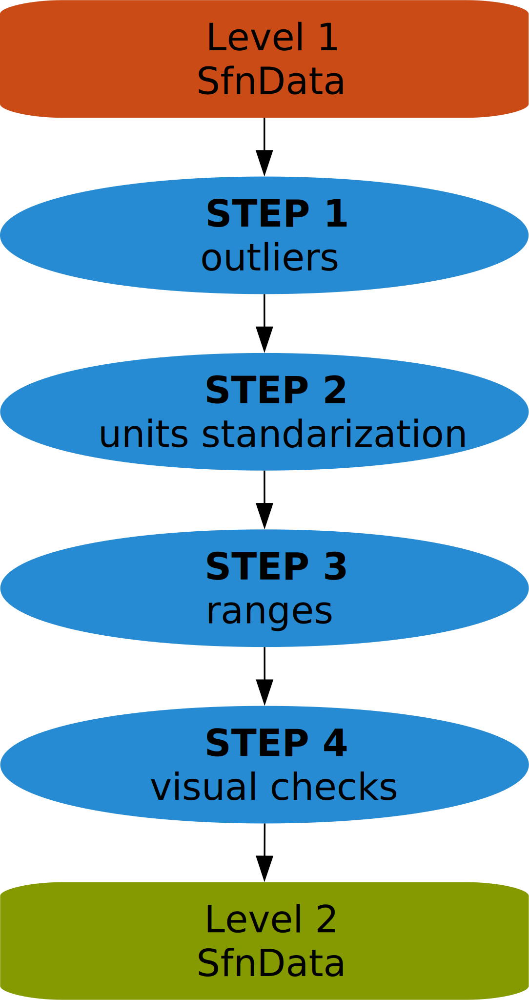
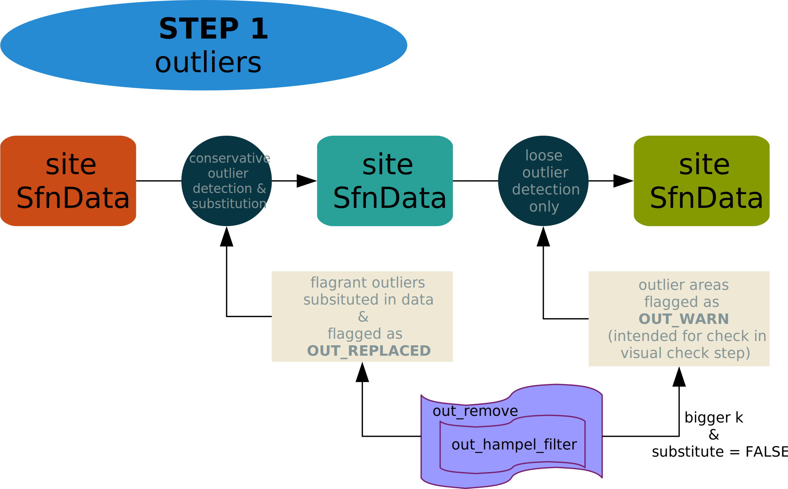
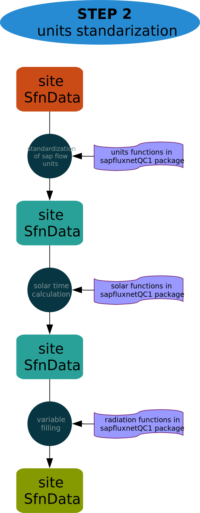
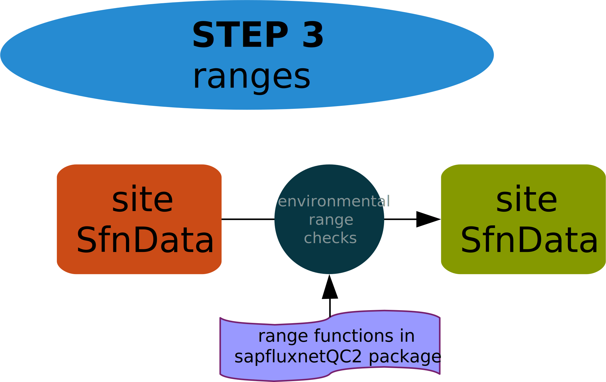
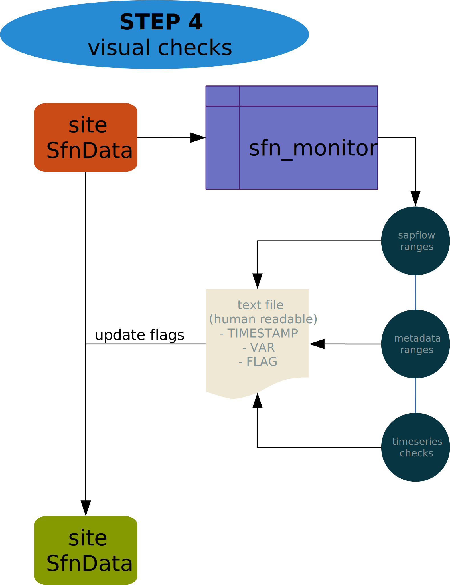

Designed workflow for level 2 stage of SAPFLUXNET Project.

## General Schematics

The general overview of the level 2 quality check involves **four main steps**:

  1. Outliers Detection and Conversion
  
  1. Units transformation and standardization
  
  1. Ranges checks
  
  1. Visual checks

Through this four steps a new SfnData object is created for the site incorporating
the transformed data (outliers, ranges, units...) and the corresponding flags.

  

## Outliers Detection and Conversion

Outliers detection is made in two different steps. First, a conservative screening
is made to flag and substitute the outliers clearly identified. Second, a
less conservative screening is made to **only** flag possible periods of *weird*
data to address in the visual checks step.

## Units transformation and standardization

In this step several operations are performed:

  + **Standardization of sap units** to $cm^3 h^{-1}$ (tree level)
  
  + **Solar time**. Original `TIMESTAMP` is maintained but also Solar Mean Time
    converted `TIMESTAMP` is calculated and stored for later use (useful for
    different sites analyses).
  
  + **Variable filling**. Some environmental variables can be calculated from
    other(s) in case that they were not provided:
      
      - *Radiation*: `ppdf_in` can be calculated from `sw_in` and viceversa
      - *vpd/rh/ta*: `vpd` is calculated from `rh` and `ta`, so in case of any
        of them were missing in this step they will be calculated.

After this operations are done, data is more completed and standardized in a way
that allows starting to wrok in some preliminar analyses.

## Range checks (only environmental)

Range checks are made for environmental variables, and only for flagrant
deviations of *natural* limits (i.e rh values above 100 or below 0). Sap flow
ranges and Metadata variables ranges are checked visually in the next step.

## Visual checks

After QC check, outliers detection, units transformations and range checks, a
visual check of the data and metadata is needed. This visual check consist in
several operations:

  + **Visual range checks**
  
      - *Sap flow ranges*. As it is difficult to establish reasonable sap flow
        limits (it depends on species, biomes...), three different limits will
        be represented in the timeseries visualizations:
        
          1. vines/lianas limit (extreme value)
          1. Gymnosperms (conifers...)
          1. Angyosperms (broadleaf...)
      
      - *Metadata ranges*. Here it is also difficult establish reasonable limits,
        so a visual check is made to detect *strange* values. In this case
        points corresponding to the site to check are compared with the points
        of the rest of the sites for detecting deviations worth of look with more
        detail.
  
  + **Visual checks of timeseries data**  
    In this case, the goal is to identify *weird* patterns in the data, worth of
    feedback with the contributor. In this step information from the loose
    outliers detection is integrated to head for *hot spots* in the data.

To do this and be able to integrate it in a semiautomated way in the quality
control process, a system for annotate TIMESTAMPS/Var combinations through a
text file is setted up (see diagram for details).

